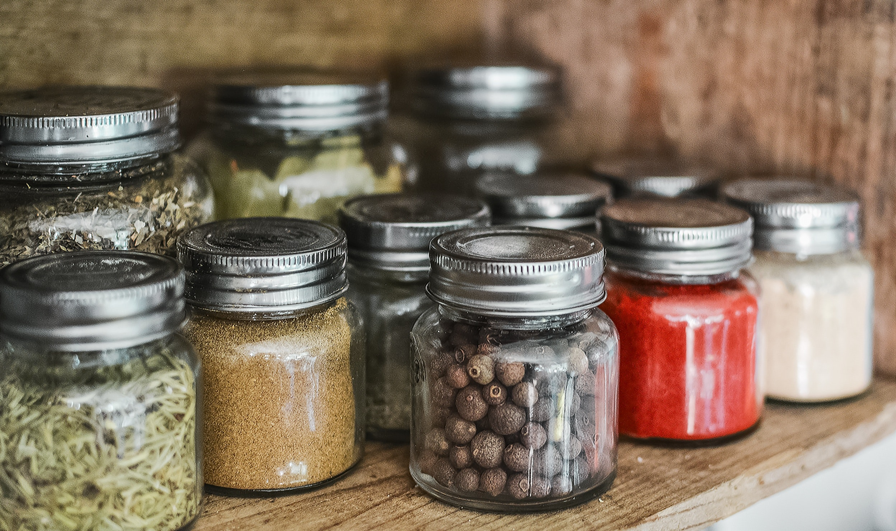

# Smart-Food-Storage
An open source application for intelligent food storage designed using Raspberry GrovePi, sensor-simulators and Influx-DB libraries. Sometimes it's useful to be able to track food consumption and plan your shopping to make it intelligent.

